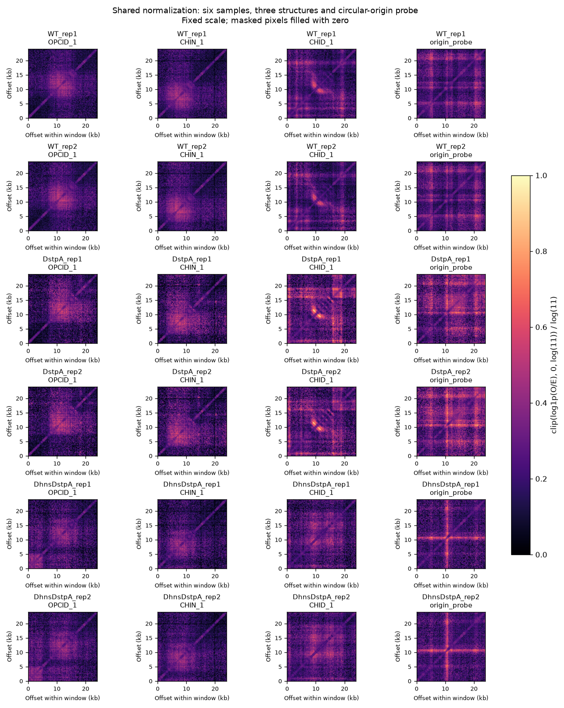

# 共享归一化、切窗与数据分组

对应 [#2](https://github.com/hycx233/deep-learning/issues/2)。分类、发现、差异分析与轨道图共用 `src/preprocessing.py`；分组集中在 `src/window_splits.py`。全部处理在 CPU 上执行，不需要 PyTorch 或 CUDA。

## 运行与交接

从仓库根目录、已安装 `requirements.txt` 的 Python 环境执行：

```bash
python scripts/prepare_annotations.py
python scripts/prepare_samples.py
OPENBLAS_NUM_THREADS=1 python scripts/prepare_data.py
```

最后一个环境变量只限制矩阵运算线程数，避免小窗口操作反复启动大量线程。首次运行会顺序处理六个样本；可以分两步执行 `--stage cache` 和 `--stage windows`。默认路径与随机种子可通过 `--help` 查看。缓存检查源文件路径、大小、修改时间与处理参数，相同输入重复运行会复用。

| 位置 | 用途 |
| --- | --- |
| `data/cache/100bp/<sample_id>.cool` | 保留整数唯一接触计数的 100 bp 工作矩阵 |
| 同目录 `.npz`、`.json` | 全局深度系数、距离背景、边际信号、有效 bin 与元数据 |
| `outputs/preprocessing/default/positions.csv` | 结构与随机背景的位置、分组、split 及环状分段 |
| `classification/windows.csv`、`windows.npz` | WT 两个重复的全部已知结构，直接交给分类模块 |
| `background/windows.csv`、`windows.npz` | 少量真实随机背景，供发现模块先接通入口 |
| `examples/windows.csv`、`windows.npz` | 六个样本的三类结构和跨起点检查窗口 |
| `splits.json`、`run_*.json` | 分组统计、种子、命令、代码指纹、参数与输出路径 |
| `normalization_examples.png` | 六个样本使用相同色标的形态预览 |

上述生成目录均被 Git 忽略；挑选的小型分组表与验证记录放在 `docs/results/preprocessing/`。分类数组的 `X` 是 float32 的 `N×128×128`，`y` 为 int64，类别顺序固定为 OPCID=0、CHIN=1、CHID=2，行序与窗口 CSV 一致。另存同形状布尔 `mask`。背景和起点检查的 `y=-1`，不能混入三分类训练。正式分类只用 WT 两个重复；突变样本保留给后续比较。

窗口表保留 `window_id,structure_id,type,chrom,start,end,center,sample_id,condition,replicate,group_id,split,segments`。跨起点时 `start` 在 `[0,L)` 内、`end=start+24000` 可超过染色体长度，真实范围由 `segments` 中的 `{start,end}` 描述。不能把这样的 `end` 直接传入普通线性读取接口。

## 归一化口径

1. 使用 Cooler 的流式聚合，把 10 bp 原始上三角 counts 相加到 100 bp。每个原始接触只统计一次，聚合后再由矩阵读取接口补对称；不会构造全基因组稠密数组。依据：[Cooler API](https://cooler.readthedocs.io/en/latest/api.html#cooler.coarsen_cooler)。
2. 全局总量 `T` 为该样本上三角唯一 counts 的和。强度矩阵为 `counts × 1,000,000 / T`，表示每百万接触的相对强度。不对每个窗口独立拉伸或归一到相同均值。
3. 轨道用的 `marginal` 为对称矩阵的行和：非对角接触加到两个端点，对角只加一次。条件轨道需先对每个重复乘深度系数，再平均。粗 bin 的对角保留唯一接触计数；不把它乘二来模仿非对角格。
4. 形态背景采用环状距离 `d=min(|i-j|,n-|i-j|)`，在全部有效 bin 上计算该距离的 counts 均值，分母包含没有像素记录的零接触对。FFT 自相关只用于计数有效 bin 对数，不补造接触信号。
5. `O/E=counts/expected_raw[d]`。先做深度归一化再计算同样的比值会得到一致结果，故直接用原始 counts。背景为零时该像素标为无效并填零，不添加随意的伪计数。
6. 模型形态统一使用 `clip(log1p(O/E),0,log(11))/log(11)`，固定截断 O/E=10，不使用每个窗口的最大值。形态掩去主对角线；强度保留对角并另有 `intensity_mask`。截断规则在预处理时固定，不根据验证或测试指标选择。

无效 bin 定义为边际信号为零或长度不是完整 100 bp。染色体末尾有一个 52 bp bin，其原始计数仍保存在工作矩阵中，但不进入强度/形态统计。环状距离是在 100 bp bin 网格上的近似；最后不足一个 bin 使跨起点距离最多相差 48 bp。真实窗口坐标和面积缩放使用实际基因组长度 4,641,652 bp，不把染色体补长到 4,641,700 bp。

全基因组深度与距离背景是固定的无监督预处理，不使用结构标签或模型指标。训练、模型选择和最终测试仍分别使用共享的 train、val、test 列表。

比较同一位置的多个样本时，使用这些样本的有效掩码交集；无效处的填零值不作为接触减弱证据。需要比较强度时读取 `intensity`，不要改用逐样本的 O/E 代替强度差异。

## 共享读取函数

```python
from src.preprocessing import load_sample, extract_window

state = load_sample("data/cache/100bp", "WT_rep1")
window = extract_window(state, center=54800)
intensity = window["intensity"]  # 深度归一化，配合 intensity_mask 比较强弱
oe = window["oe"]               # 未逐窗口缩放的 O/E，配合 mask
model_input = window["model"]   # 固定变换并缩放为 128×128
```

窗口默认 24 kb，以给定 `center` 为中心。跨起点时读取首尾两段的四个矩阵块，包括连接两段的非对角接触；不是只把两个对角块拼起来。100 bp bin 与窗口端点不一定整齐对齐，局部矩阵通常为 240—242 格，`window_edges` 给出从窗口起点开始的实际 bp 边界。

128×128 缩放采用真实 bin 区间与目标格的重叠面积作权重，只平均有效面积。输出 `model_mask` 和 `model_valid_fraction`，无有效面积处填零。这避免把末尾 52 bp 格当成完整 100 bp，同时保证两个轴使用一致坐标。

## 分组原则

对已知结构的完整 24 kb 窗口求环状空间重叠连通分量。同一分量包含的不同结构、重复或后续增强必须沿用同一 split。固定种子只根据注释类别数与总量分配约 70%/15%/15%；不用任何模型结果选择划分。

随机背景的位置不与任何已知结构注释相交。如果背景窗口碰到多个已有 split，丢弃这个抽样位置；与已有窗口相交时继承其 split，并继续检查后续背景。读取的 100 bp 边缘 bin 也不能在不同集合复用。后续发现模块增加滑窗训练样本时仍需遵守同样边界，不能把整条染色体的滑窗都作为训练集后再宣称独立测试。

`origin_probe` 只是验证首尾连接的检查位置，标为 `split=probe`，不参与三个正式集合。分类模块必须使用导出的 `split`，不要改回仅按结构 ID 随机分组。

## 验证

针对性检查可独立运行，不触发完整预处理或模型训练：

```bash
OPENBLAS_NUM_THREADS=1 python -m unittest discover -s tests -v
```

2026-09-20 已用全部六份真实数据跑通。首次生成缓存耗时约 253 秒，复用缓存导出窗口及绘图约 23 秒。九项针对性检查通过；六个样本的总计数均与原始 Cooler 元数据相同，WT rep1 的五个普通/首尾窗口另与原始 10 bp 局部像素独立聚合结果逐元素核对一致。

344 条结构形成 59 个空间连通分量，最大分量 20 条；不排除任何已知结构即可得到下表。按 100 bp 实际读取 bin 独立检查，跨集合共享 bin 数为零。

| 集合 | OPCID 位置 | CHIN 位置 | CHID 位置 | 结构位置总数 | WT 两重复窗口数 | 随机背景位置 |
| --- | ---: | ---: | ---: | ---: | ---: | ---: |
| train | 48 | 175 | 18 | 241 | 482 | 17 |
| val | 10 | 37 | 4 | 51 | 102 | 4 |
| test | 10 | 38 | 4 | 52 | 104 | 3 |

用分类 PR #13 的实际读取与分组代码加载了 688 个真实输入，`X/y/CSV` 一致且原样沿用提供的 split。48 个背景窗口和 24 个六样本检查窗口同样完成有限数、对称性、标签、行序及坐标检查。没有进行模型训练。

已保存[验证记录](results/preprocessing/validation.json)、[分组摘要](results/preprocessing/splits.json)、[位置列表](results/preprocessing/positions.csv)和下图。这些输出验证数据流程，不代表已完成分类训练、发现实验或生物学差异分析。


