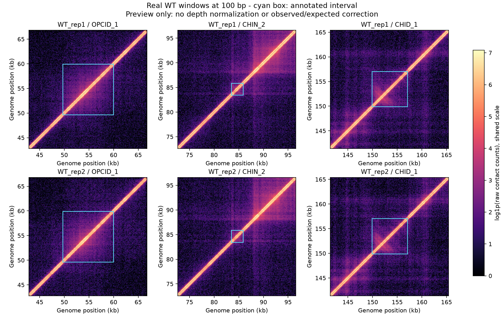

# 数据准备与 CPU 交接样例

对应 [#1 标注与样本整理](https://github.com/hycx233/deep-learning/issues/1)，为 [#2 正式预处理](https://github.com/hycx233/deep-learning/issues/2)提供真实输入。已在 Python 3.12.14 / Linux 上用课程原始数据运行；本步骤不使用 GPU，不训练模型。

## 运行

从仓库根目录执行。先按 `data/README.md` 放置两个 WT `.cool`、`GSE272161_RAW.tar` 和标注 Excel。

```bash
python -m venv .venv
source .venv/bin/activate
python -m pip install -r requirements.txt

python scripts/prepare_annotations.py
python scripts/prepare_samples.py
python scripts/preview_structures.py
```

脚本参数通过 `--help` 查看。原始输入保留不变；四个选定的突变矩阵解压到忽略的 `data/raw/`。已经存在且元数据有效的文件直接复用，重复运行不必重新解压。三个小型 CSV 纳入 Git，方便其他成员直接查看和复现。

## 已生成的表

| 文件 | 内容与行数 | 关键字段 |
| --- | --- | --- |
| `data/structures.csv` | 344 条：OPCID 68、CHIN 250、CHID 26 | `ID,type,chrom,start,end,center,length_bp` |
| `data/genes.csv` | 4516 条基因，4451 个不同名称 | `gene_id,name,chrom,start,end,strand,length_bp` |
| `data/samples.csv` | WT、DstpA、DhnsDstpA 各两个重复，共 6 条 | `sample_id,condition,replicate,path,chrom,source_chrom,bin_size` |

结构与基因表还保留 `source_sheet`、`source_row`、`source_chrom` 和原始坐标；CHIN 另保留 `source_center`。同名基因可以位于不同位置，不能按 `name` 去重。结构的 `ID` 直接沿用 Excel，例如 `OPCID_1`；后续窗口表的 `structure_id` 应取这个值。

样本表的路径相对仓库根目录，`replicate` 为整数 1/2；条件代码 `DstpA` 对应 ΔstpA，`DhnsDstpA` 对应 ΔhnsΔstpA。表中记录原压缩包成员、分辨率、像素行数、counts 类型、是否存在 weight 等信息。

六个实际文件的染色体名均为 `NC_000913.3`，分辨率均为 10 bp，染色体长 4,641,652 bp，各有 464,166 个 bin，counts 为 int32，存储模式为 symmetric-upper，均没有 `weight` 列。四个突变样本文件名虽含 `MG1655`，其实际染色体名也为 `NC_000913.3`。

## 坐标处理依据

统一的下游接口使用 `chrom=NC_000913.3`、0-based 左闭右开区间，但基因与结构的源数据需分别处理。

**基因：起点减一，终点不变。** Table 1 的 `thrL: 190..255 (+)`、`hns: 1292509..1292922 (-)` 与 NCBI 的 1-based inclusive 注释范围一致，转换后分别为 `[189,255)`、`[1292508,1292922)`，链方向保持不变。依据：[NCBI thrL](https://www.ncbi.nlm.nih.gov/gene/944742)、[NCBI hns](https://www.ncbi.nlm.nih.gov/gene/945829)。

**结构：保留原始 Start/End 数值，不减一。** 作者公开分析代码将结构坐标直接按 `coordinate // 25` 分箱，没有先减一。对照作者的区间文件，68 条 OPCID、250 条 CHIN（区间与中心）、26 条 CHID 的直接分箱结果全部匹配。来源固定在作者仓库提交 `97d61efb980599c93deba6d3c1b651bc2bd4bb60`：[pins.py](https://github.com/irzhegalova/ecoli_microc/blob/97d61efb980599c93deba6d3c1b651bc2bd4bb60/scripts/pins.py#L35-L58)、[标注文件目录](https://github.com/irzhegalova/ecoli_microc/tree/97d61efb980599c93deba6d3c1b651bc2bd4bb60/data)。

作者文件为 `TADS_25.bedpe`、`hTADS_25.bedpe`、`hairpins_25.bed`、`hairpins_25.middle.bed`。核对时，锚点所在 bin 的左边界为 `(coordinate // 25) * 25`，右边界为 `(coordinate // 25 + 1) * 25`。

论文说明结构来自接触图上的人工标注，但未找到 Excel 端点逐碱基开闭的明确声明。因此“结构沿用作者接触图坐标，项目解释为 `[start,end)`”是本项目的接口约定，不宣称原文已明确规定。CHIN 的 Center 始终复制原字段。参见[原论文标注方法](https://www.nature.com/articles/s41586-025-09396-y#Sec11)。

## 三类定位示例

| ID | 项目区间 | Center | 来源 |
| --- | --- | ---: | --- |
| OPCID_1 | `NC_000913.3:[49660,59940)` | 54800 | Table 4 第 2 行 |
| CHIN_1 | `NC_000913.3:[58260,59420)` | 58840 | Table 5 第 2 行 |
| CHID_1 | `NC_000913.3:[149900,157060)` | 153480 | Table 6 第 2 行 |

## 本次验证与后续边界

- 344 条结构、4516 条基因逐行回查 Excel 的来源行与原始字段，计数、唯一 ID、坐标范围、长度与 CHIN 原 Center 均通过检查。同名不同位置完整保留。
- 六份真实 `.cool` 完成少量元数据核对；只解压所选四个突变样本，总计约 695 MiB。重复运行的样本表一致，已解压文件不重写。
- 真实预览取 WT rep1/rep2 中三个结构附近的 24 kb 窗口，聚合到 100 bp，仅用于检查输入和交接。窗口数组与位置表保存在 `outputs/data_preparation/`。
- 预览热图显示统一色标的 `log1p(raw counts)`，尚未做测序深度归一化或 O/E；这些窗口不是正式训练集，不能用于条件差异结论。
- #2 仍需完成共享归一化、环状边界处理、128×128 模型输入和防止空间重叠泄漏的数据分组。分类入口已经有 PR #13，后续窗口表应提供 `structure_id` 和正式 `split`，不能只凭不同结构 ID 就认定相互重叠的窗口独立。

已检查的[六窗口位置表](results/data_preparation/positions.csv)和下图随仓库保存，便于直接查看。预览使用 OPCID_1、CHIN_2、CHID_1；CHIN 选择第二条是为了与 OPCID 示例错开位置。位置表中的 `matrix_file` 对应本地 `outputs/data_preparation/` 下的文件，可重新运行预览脚本生成。



轻薄本可以完成这里的标注、解压和局部窗口读取。正式 CNN / 自编码器训练再按计划使用 RTX 2080 Ti；今天无需安装或配置 CUDA。
