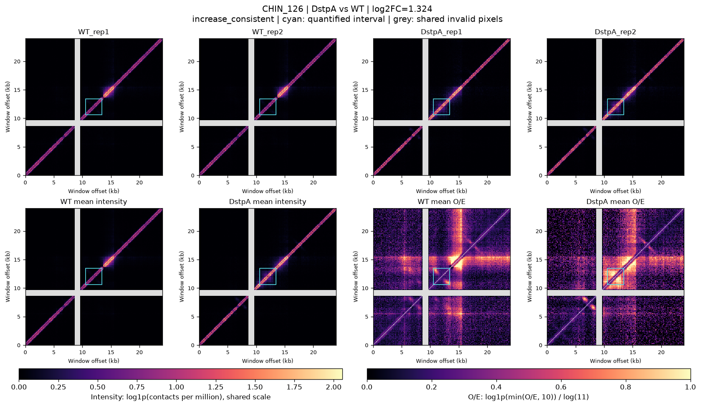
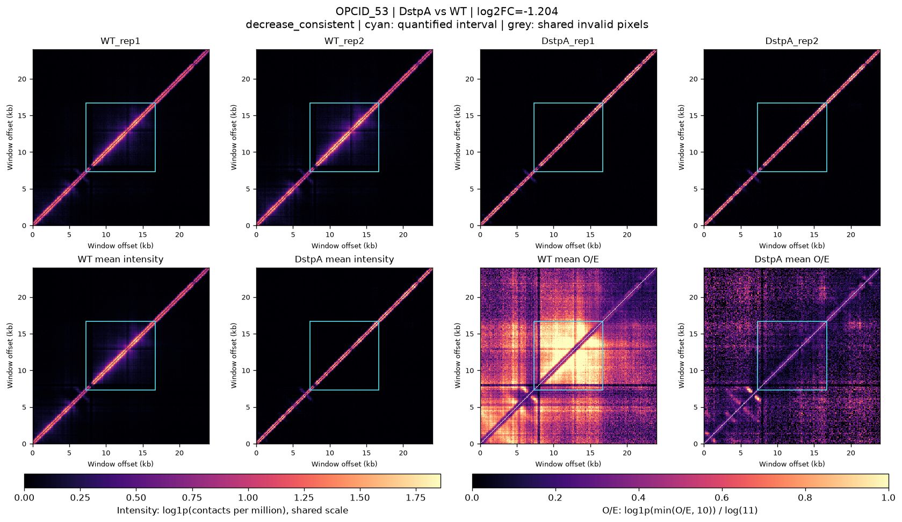

# 条件差异分析

对应 [#8](https://github.com/hycx233/deep-learning/issues/8)。比较 ΔstpA、ΔhnsΔstpA 两个条件相对 WT 的接触信号，复用 [共享预处理](共享预处理说明.md) 的 100 bp 工作矩阵。所有计算在 CPU 上完成，不需要显卡。

本轮只分析 `data/structures.csv` 中的 344 条已知结构，分别比较两个条件，完整结果应为 688 行。发现模块的候选待相关结果复核后再补充；已知结构发生条件差异不等于发现了新结构。

## 运行方法

先按数据说明准备六个样本，并完成共享缓存：

```bash
python scripts/prepare_annotations.py
python scripts/prepare_samples.py
OPENBLAS_NUM_THREADS=1 python scripts/prepare_data.py --stage cache
OPENBLAS_NUM_THREADS=1 python scripts/compare_conditions.py \
  --case-count 8 --min-fold-change 1.25
```

默认输入为 `data/structures.csv`、`data/samples.csv`，缓存目录为 `data/cache/100bp`，输出目录为 `outputs/differences/known_structures`。其余路径选项见 `python scripts/compare_conditions.py --help`。完整表、运行摘要和批量图保存在该输出目录；准备写入报告的小型结果与精选图保存在 `docs/results/differences/`。

| 输出 | 内容 |
| --- | --- |
| `differences.csv` | 全部结构与两个突变条件的比较 |
| `cases.csv` | 所选代表案例、图路径和标签解释 |
| `summary.json` | 状态、各标签数量和分析范围 |
| `run.json` | 实际命令、参数、代码与输入指纹、运行时间 |
| `figures/` | 每例一张 WT 与当前突变条件的并排图 |

## 强度汇总

**统计区域是标注的原始 `[start,end)`，不是整张 24 kb 上下文窗口。** 六个样本都在相同区域和相同有效像素上比较，防止附近其他结构或单一样本的无效 bin 改变结论。

对 100 bp bin `i`，记它与标注区域相交的长度除以 100 bp 为 `a_i`。像素 `(i,j)` 的面积比例权重为 `w_ij=a_i*a_j`，这样非整百的标注边界不会被当作一个完整 bin。只使用上三角 `i<j`，排除主对角线并避免对称矩阵重复计数。有效集合取 WT、ΔstpA、ΔhnsΔstpA 的全部六个重复的 `intensity_mask` 交集。

对每个样本，以有效权重汇总深度归一化强度：

```text
intensity_ij = raw_count_ij × 1,000,000 / sample_total_contacts
S_sample = sum(w_ij × intensity_ij) / sum(w_ij)
```

这表示该结构内部的平均每百万接触强度，不是结构总接触计数。共享预处理定义的无效 bin 不参与分子和分母；窗口独立缩放的图像值不能用于该统计。

## 条件变化与 WT 重复参照

每个条件先对两个重复的结构强度取算术均值，然后计算相对 WT 的对数倍数：

```text
WT_mean = (WT_rep1 + WT_rep2) / 2
condition_mean = (condition_rep1 + condition_rep2) / 2
log2_fc = log2(condition_mean / WT_mean)
replicate_log2_ratio_r = log2(condition_repr / WT_mean)
WT_repeat_log2_ratio = log2(WT_rep2 / WT_rep1)
```

不添加伪计数。零强度、缺少有效像素对等无法支持对数比较的情况输出相应状态，不强行标成增强或减弱。

默认最低变化倍数为 1.25，每个结构的显示参照带为：

```text
band = max(log2(1.25), abs(WT_repeat_log2_ratio))
```

两个突变重复各自相对 `WT_mean` 都高于 `band` 才标为 `increase_consistent`（一致增强），都低于 `-band` 才标为 `decrease_consistent`（一致减弱）；都落在参照带内时为 `within_reference`，其他组合为 `inconsistent_or_borderline`。这比仅看两个重复的均值能更直接呈现重复是否一致。

这些标签是固定规则的**描述性分类，不是显著性检验或统计置信区间**。`within_reference` 表示本次重复和所用规则下未超出参照带，不能推导为两个条件完全相同。只有两个生物学重复时，报告各重复数值和方向比给出缺乏依据的显著性结论更合适。

结果表保留以下字段，方便其他模块直接读取：

| 字段 | 含义 |
| --- | --- |
| `structure_id,type,chrom,start,end,center,length_bp,condition` | 原结构标识、区间及待比较条件 |
| `wt_rep1,wt_rep2,wt_mean,mutant_rep1,mutant_rep2,mutant_mean` | 四个相关重复及条件均值的结构强度 |
| `log2_fc,rep1_log2_fc,rep2_log2_fc,wt_rep_log2_ratio,reference_band` | 条件、各重复及 WT 参照量 |
| `replicate_direction_agreement,effect_label` | 前者只检查两个对数比是否同号；后者还要求越过参照带，两者含义不同 |
| `valid_pair_count,valid_weight_fraction,roi_weight_sum` | 公共有效非对角格数、有效权重占完整 ROI 权重的比例、掩码前 ROI 总比例权重 |
| `oe_mean_abs_difference,status` | O/E 形态辅助差及该行强度比较状态 |

`status=ok` 才能解释倍数和方向标签。其余状态为 `no_common_valid_pairs`、`nonpositive_intensity`、`nonfinite_intensity`，对应 `effect_label=not_evaluable` 且比值不可用。若仅 O/E 公共形态掩码没有有效对，O/E 辅助量为空，强度状态仍可为 `ok`。这些情况都不通过伪计数或静默填零继续比较。

## 形态辅助量与案例图

强度变化之外，另计算结构区域内的 O/E 形态差异。先分别平均条件与 WT 的两个重复的 O/E，再在六样本公共形态掩码下，对以下值求同样的面积加权均值：

```text
abs(log1p(mean_OE_condition) - log1p(mean_OE_WT))
```

该量只补充说明距离背景校正后的形态变化程度，没有增强或减弱方向，也不能代替上面的深度归一化强度倍数。共同有效区域外的填零值不进入比较。

默认选择 8 个案例，仅从 `status=ok`、公共有效权重比例至少 0.8 的结果中选取，在实际存在时覆盖两个条件下的增强、减弱、参照带内和边界组合。同一结构只选一次；完整表仍保留它在两个条件下的结果。

每例展示 WT 与当前突变条件的四个重复强度热图，以及这两个条件的均值强度、O/E 对照，共八个面板。每例所有强度面板以 `log1p(intensity)` 展示并共用色标；O/E 面板沿用共享的固定变换 `log1p(min(O/E,10))/log(11)` 和 `[0,1]` 色标。**变换只用于展示**，强度倍数取自未取对数的深度归一化强度，O/E 辅助差也不截断。青色框标出实际量化的原结构区间，灰色表示共同无效区域。

强度图的色标按每例统一，不应用两张不同案例图的颜色直接比较绝对强度。案例用于解释结果，完整表仍保留全部结构与两种比较，不只汇报变化最大的结构。

ΔhnsΔstpA 是双缺失条件，观察到的全部变化不能归因于其中一个因子。结果应表述为“在该条件下观察到某结构信号增强或减弱”，不宣称本分析证明了单一蛋白的因果作用。

## 本次运行结果（2026-09-20）

六个真实样本的 344 个已知结构已完成比较，得到 688 行结果，全部为 `status=ok`，并保存 8 个代表案例。本机使用 CPU 复用缓存完成全量比较和绘图，最终运行耗时 43.96 秒，命令、参数及代码指纹见[运行记录](results/differences/run.json)。按照上述固定规则，各条件结果如下；每行合计 344 个结构。

| 条件 | 一致增强 | 一致减弱 | 参照带内 | 不一致或边界组合 |
| --- | ---: | ---: | ---: | ---: |
| ΔstpA 相对 WT | 217 | 6 | 94 | 27 |
| ΔhnsΔstpA 相对 WT | 182 | 10 | 92 | 60 |

两个条件下重复相对 WT 的方向同号的结构分别为 338 和 320 个，但“同号”并不保证两个重复都越过参照带，所以不能用这两个数量代替一致增强或减弱的数量。两条件下大部分结构被标为相对强度增强；这里比较的是每百万接触的相对强度，不能据此直接推断细胞内绝对接触总量增加。

公共有效权重比例的最低值为 **24.32%（CHIN_171）**。共有 12 个结构、24 行条件比较低于 80%，仍在完整结果表中如实保留；`status=ok` 只表示公共有效区域支持计算，并不表示整个标注区间都有效。这些结构不进入代表案例，解释其结果时应同时查看有效比例。本次 8 个代表案例的公共有效权重比例均为 100%。

以下数值均直接来自 `cases.csv`。两个重复的对数比都相对于 WT 均值；这 8 个案例的参照带均为 ±0.322（表中四舍五入）。

| 结构 | 条件 | 条件 log2FC | 两重复 log2 比 | 案例解释 |
| --- | --- | ---: | --- | --- |
| CHIN_126 | ΔstpA | 1.324 | 1.306 / 1.342 | 两重复均增强，均值为 WT 的约 2.504 倍 |
| OPCID_53 | ΔstpA | -1.204 | -1.197 / -1.212 | 两重复均减弱，均值约为 WT 的 0.434 倍 |
| OPCID_5 | ΔstpA | 0.003 | -0.009 / 0.016 | 两重复轻微异号但均在带内，均值接近 WT |
| OPCID_4 | ΔstpA | 0.596 | 0.883 / 0.239 | 均值上升，但只有一个重复超过上参照线 |
| CHIN_53 | ΔhnsΔstpA | 1.580 | 1.628 / 1.529 | 两重复均增强，均值为 WT 的约 2.989 倍 |
| OPCID_57 | ΔhnsΔstpA | -1.227 | -1.145 / -1.314 | 两重复均减弱，均值约为 WT 的 0.427 倍 |
| OPCID_19 | ΔhnsΔstpA | 0.002 | 0.067 / -0.066 | 均值接近 WT，两个重复均在参照带内 |
| CHIN_231 | ΔhnsΔstpA | 0.400 | 0.477 / 0.320 | 第二个重复略低于 0.322 的门槛，保留为边界组合 |

这些案例说明了区分条件均值与重复一致性的必要性：OPCID_4 的均值约为 WT 的 1.512 倍，仍没有被标为一致增强；OPCID_5、OPCID_19 的微小异号也没有被夸大为明显相反的变化。

[完整差异表](results/differences/differences.csv)、[运行摘要](results/differences/summary.json)和[八个代表案例](results/differences/cases.csv)随本任务保存至 `docs/results/differences/`。下面展示 ΔstpA 条件下的一致增强和一致减弱各一例。





后续候选补充应保持相同的强度、掩码与方向判定口径，并单独标明其候选身份，不能与本次 344 个已知结构的统计混在一起。
